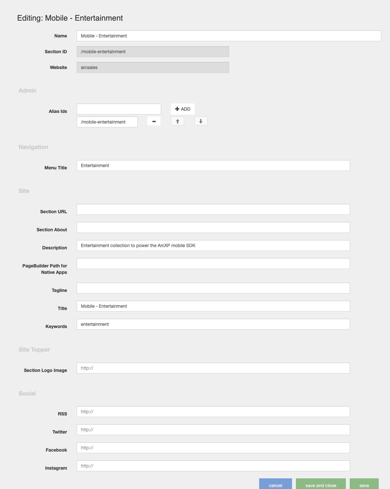
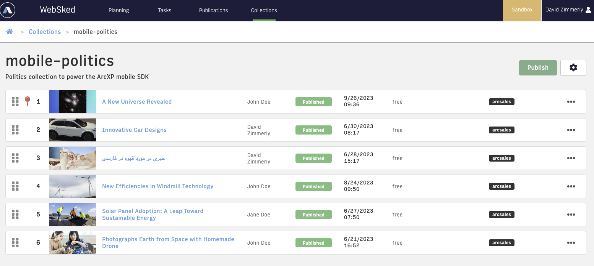

# Back End Setup

Outbound feeds are standard for Arc XP clients. This should be set up during launch. To get started with our SDK, contact your Technical Account Manager to ensure your CDN is set up and to get the base URL for outbound feeds.

You use the following Arc XP publishing tools to set up backend data:

* **Site Service** - how you define what comes back for section list names (and power your navigation)
* **Collections** - for each section list name, we query for a list of articles.
* **WebSked** - workflow and task management tool.

We recommend familiarizing yourself with these tools before continuing using these tutorials:

* [Site Service: Overview](https://docs.arcxp.com/en/products/site-service/getting-started-with-site-service.html)
* [Managing Sections In Site Service](https://docs.arcxp.com/en/products/site-service/managing-sections-and-fields-in-site-service.html)
* [Getting Started with WebSked](https://docs.arcxp.com/en/products/websked/getting-started-with-websked.html)
* [Understanding Collections](https://docs.arcxp.com/en/products/websked/understanding-collections.html)

## Prerequisites

* Ensure you can access your organization's Arc XP home page. The URL format is `https://{orgID}.arcpublishing.com/home`.
* Ensure you have the base URL for your organization. This is provided by Arc XP.
* Ensure outbound feeds has been set up. From your organization's Arc XP home page, confirm that an outbound feeds tile is listed in the Experiences section.
* Confirm the following values appear on the home page. You need these values when setting up the configuration object of the example newspaper app:

## Setting Up Navigation

Create a mobile navigation Site Service containing the sections you want to display on mobile.

1. Create desired sections on your site
2. Create site navigation.
3. The display name is the menu title
4. Keep track of the **collection alias names for each section** you add to your site hierarchy. The alias name is in the Section ID field, starting with a slash (’/’).  

    

> **Note**: The newspaper example app does not currently support child sections. If you create child sections they will be ignored.

Test the navigation by using a web browser to navigate to `https://{base URL}/arc/outboundfeeds/navigation/mobile-nav`. If you have chosen a name different from ‘mobile-nav’ then replace the last part of the URL with your specified name.

The name specified for navigation will be used in setting up the newspaper app configuration object as the mobile nav endpoint value.

## Setting Up Collections

Now you can create collections in WebSked and populate them with content. You must map the collections to the site entries you just created, using the alias names (which is the Section ID field in Site Service).

1. Navigate to WebSked by clicking on the Arc XP logo in the top left corner and select WebSked under Planning.
2. Create a collection. Click Collections on the top menu bar and then the “Create collection” button.
3. Enter the name and add the content alias that matches the site section alias created during site service creation. **Do not include the slash when entering the name.**
4. Repeat this for each site created in the previous section.
5. You can now pitch articles/videos to this collection via WebSked or Video Center for videos. This step was covered in the WebSked course. Once stories have been pitched they will show up in the collection. Alternatively, you can use dynamic curation to automatically populate collections.

A video collection can be created using the same process. The video collection must only be populated with videos. The name of the video collection is specified in the newspaper app configuration as video collection name. This is how the app will recognize the video collection rather than from the site service.

## Next Step

Now that site navigation and collections are set up the news app resolvers need to be set up in order for the collection endpoints to be able to return data. The following document will explain this step.

[Mobile SDK - Resolver Setup](mobile-sdk-resolver-setup.md)

## Recommended Reading

* [Getting Started with Site Service](https://docs.arcxp.com/en/products/site-service/getting-started-with-site-service.html)
* [Managing Sections In Site Service](https://docs.arcxp.com/en/products/site-service/managing-sections-and-fields-in-site-service.html)
* [Getting Started with WebSked](https://docs.arcxp.com/en/products/websked/getting-started-with-websked.html)
* [Understanding Collections](https://docs.arcxp.com/en/products/websked/understanding-collections.html)
