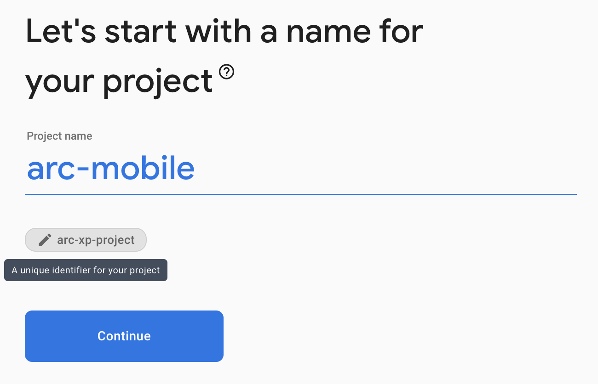
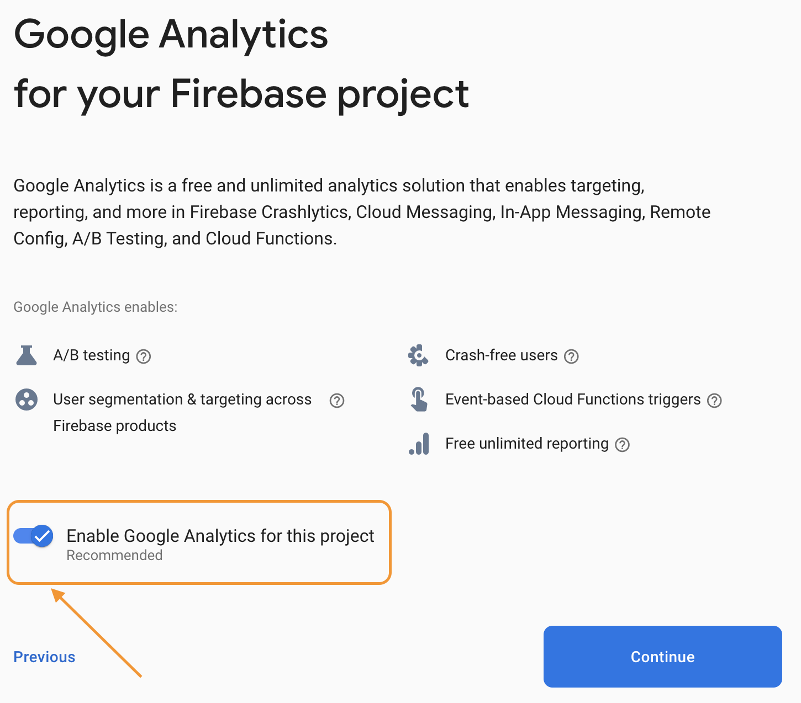
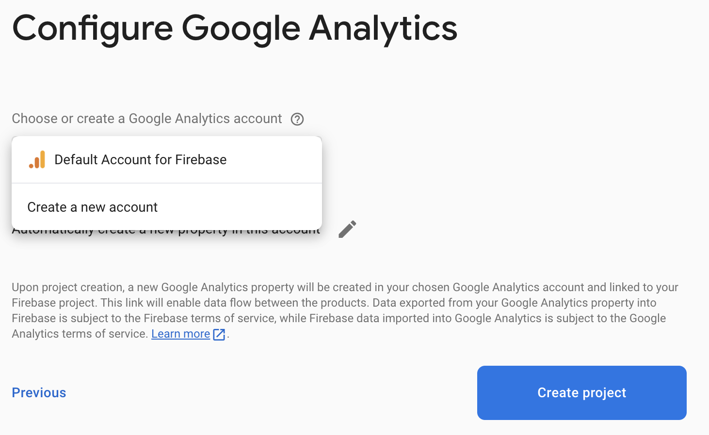
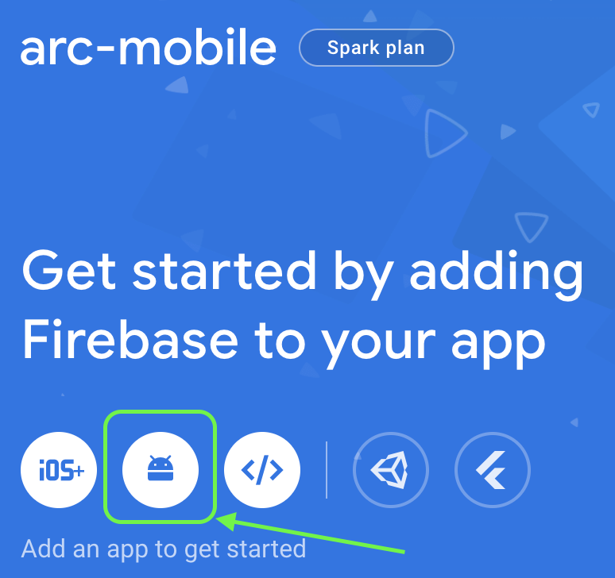
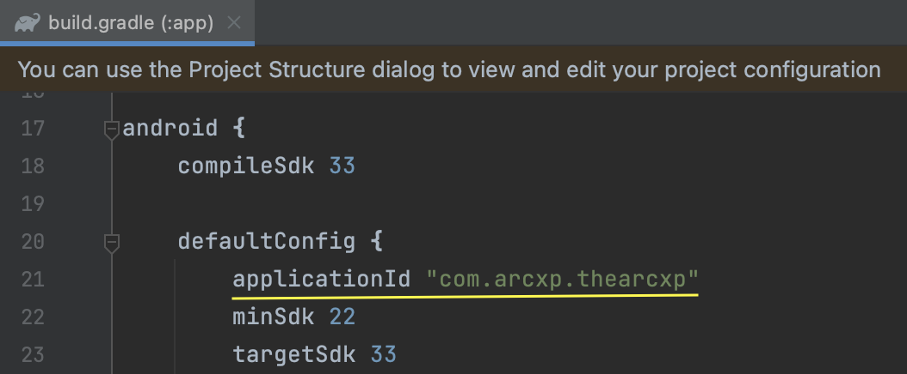
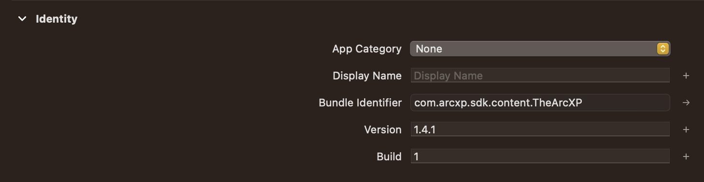
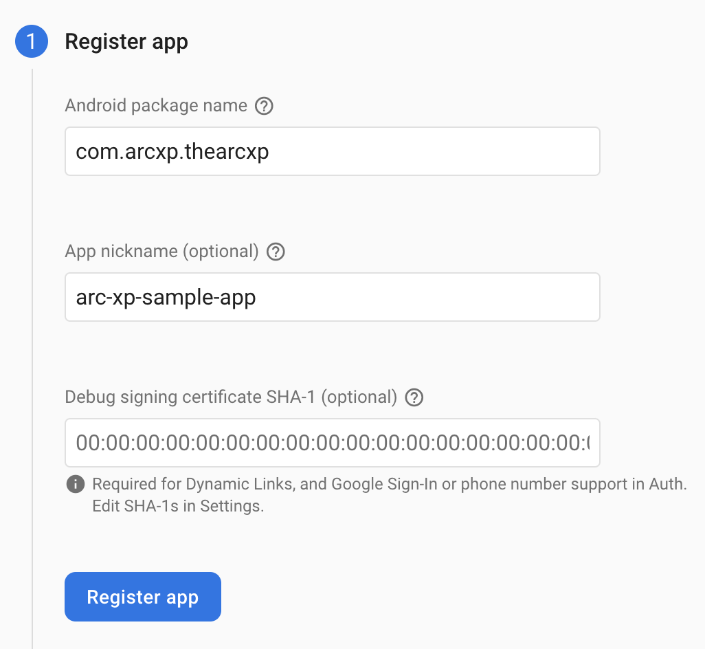
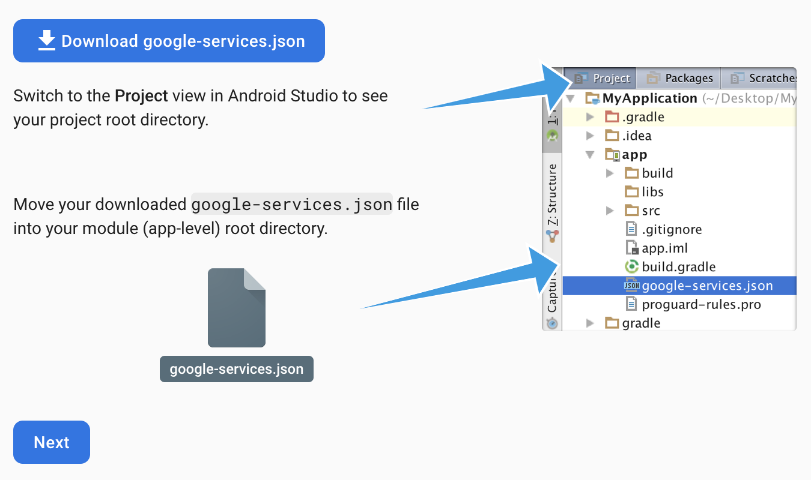
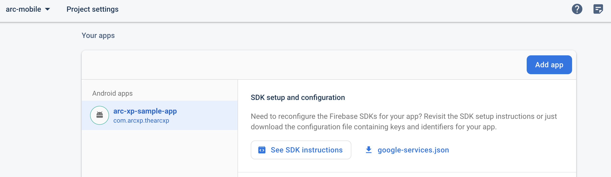

This guide covers getting started with Firebase for your Android/iOS project. Firebase is a comprehensive mobile and web application development platform provided by Google, offering a wide variety of services, including Realtime Database, Authentication, Cloud Functions, Firebase ML and more.

## Getting Started with Firebase

### Connect your Android/iOS app to Firebase using Firebase Console

1. Go to the [Firebase Console](https://console.firebase.google.com/) and sign in with your Google account.
2. Create a new project by clicking on the **Add Project** button or select an existing project if you have one. A Firebase project can contain one or more apps: you can register your Apple, Android, or web apps. You can also view combined analytics data across all apps within the same project.

### Creating a new project

1. Enter a project Name (Example: Arc XP Mobile Analytics). You can also optionally edit the project ID displayed below the project name.
    

2. Click **Continue**.
    You can add Google Analytics to your project, which enables you to have an optimal experience using Firebase products, including [Firebase Crashlytics](https://firebase.google.com/docs/crashlytics), [Firebase Cloud Messaging](https://firebase.google.com/docs/cloud-messaging), [Firebase Remote Config](https://firebase.google.com/docs/remote-config) or [Firebase A/B Testing](https://firebase.google.com/docs/ab-testing). Either select an existing Google Analytics account or create a new account.
    
    

3. Click **Create project**.

### Register your app with Firebase

1. From the Firebase console, choose your project. On the project overview page, click the **Android/iOS** icon to start the setup workflow for your app.
2. Enter your app's package name in the **Android package name** field or bundle ID in the **bundle ID** field. To find the Android package name, go to your `app/build.gradle` file and look for the `applicationId` property (Example package name: `com.arcxp.thearcxp`). To find the iOS bundle ID open your project in Xcode, select the top-level app in the project navigator, then select the **General** tab. The value of the **Bundle Identifier** field is the bundle ID.
    

3. Enter additional app information:
    * **App nickname** is a convenience identifier that is only visible to you in the Firebase console
    * **Debug signing certificate SHA-1**: A SHA-1 hash is required by Firebase Authentication (when using Google Sign-In or phone number sign-in) and Firebase Dynamic Links. [See this page](https://developers.google.com/android/guides/client-auth) for information on using **keytool** to get the SHA-1 hash of your signing certificate.  
    

4. Click **Register app**.

## Add a Firebase configuration file

### Android

1. Click **Download google-services.json** to obtain your Firebase Android config file.
2. Move your config file into the **module (app-level)** root directory of your app.
3. Switch to Project view in Android Studio to see the app directory.
  

### iOS

1. Click **Download GoogleService-Info.plist** to obtain your Firebase Apple platforms config file (`GoogleService-Info.plist`). 
2. Move your config file into the root of your Xcode project. If prompted, select to add the config file to all targets.

This config file contains unique, but non-secret identifiers for your project. To learn more about this config file, visit [Understand Firebase Projects](https://firebase.google.com/docs/projects/learn-more#config-files-objects). 

[Warning]
We do not recommend adding the google-services.json/GoogleService-Info.plist file to version control, as it contains sensitive configuration data for your Firebase project. Including this file in version control could lead to potential security risks. For more information on best practices for securing your Firebase configurations, please refer to [Arc XP Mobile SDK Security Best Practices](security-best-practices.md).

You can download your [Firebase config file](https://support.google.com/firebase/answer/7015592) again at any time from your **Project settings** in the Firebase console.



Please refer to the official [Firebase documentation](https://firebase.google.com/docs/android/setup) for further details and information on how to use specific Firebase services in your Android app.

## Sample Application**

The most effective way to understand the integration of analytics and push notifications is to observe the implementation provided in the iOS and Android sample apps.. These apps, in combination with the Firebase documentation for each platform, will provide a detailed overview of integrating these features into your app.

The following sections will give an overview of details specific to the ArcXP SDKs.

## Google Analytics: Custom events

Analytics automatically logs some [events](https://support.google.com/analytics/answer/9234069) for you; you don't need to add any code to receive them. If your app needs to collect additional data, you can log up to 500 different Analytics Event _types_ in your app.

If your application has specific needs not covered by a recommended event type, you can log your own custom events as shown in this example(iOS):

```kotlin
Analytics.logEvent("share_image", parameters: [
  "name": name as NSObject,
  "full_text": text as NSObject,
])
```

Custom parameters can be used as [dimensions or metrics](https://support.google.com/analytics/answer/10075209) in [Analytics reports](https://support.google.com/analytics/answer/9212670). You can use custom dimensions for non-numerical event parameter data and custom metrics for any parameter data better represented numerically. Once you've logged a custom parameter using the SDK, register the dimension or metric to ensure those custom parameters appear in Analytics reports. Do this via: **Analytics > Events > Manage Custom Definitions > Create Custom Dimensions**

You can view aggregated statistics about your events in the Firebase console dashboards. These dashboards update periodically throughout the day. You can access this data from the [**Events dashboard**](https://console.firebase.google.com/project/_/analytics/events) in the Firebase console. This dashboard shows the event reports that are automatically created for each distinct type of event logged by your app.

Between both platforms, below are the events that both platform apps report:

* login
* signup

They both have a custom dimension defined, `login_type` and `signup_type` respectively.

## Push Notifications: Subscribing to topics

FCM topic messaging allows you to send a message to multiple devices that have opted in to a particular topic.

Client apps can subscribe to any existing topic, or they can create a new topic. When a client app subscribes to a new topic name (one that does not already exist for your Firebase project), a new topic of that name is created in FCM and any client can subsequently subscribe to it. To subscribe to a topic, call the subscription method from your application's **main** thread (FCM is not thread-safe).

Subscribe to a topic with the following call:

```kotlin
Messaging.messaging().subscribe(toTopic: "weather") 
```

Detailed implementations are provided in the iOS and Android sample apps.
