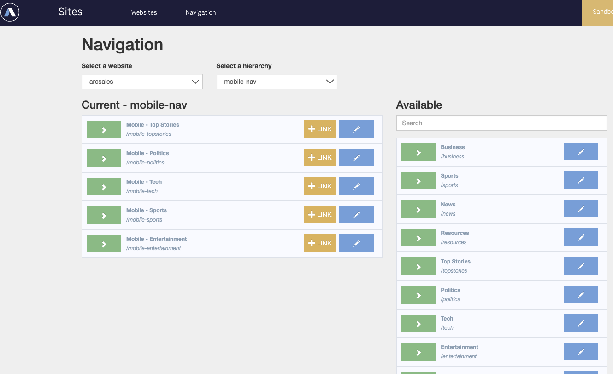
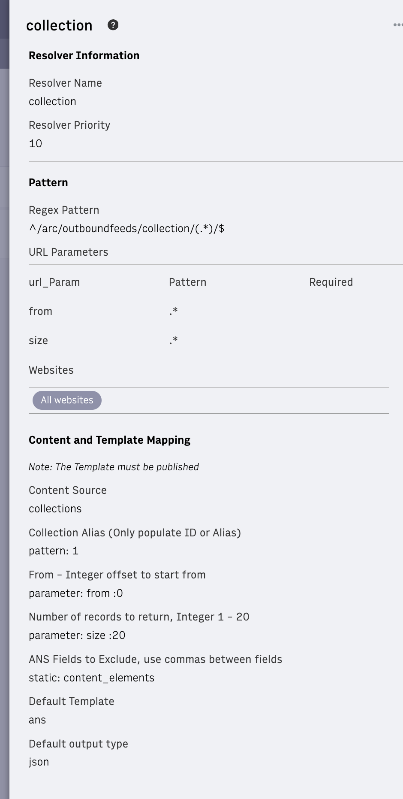
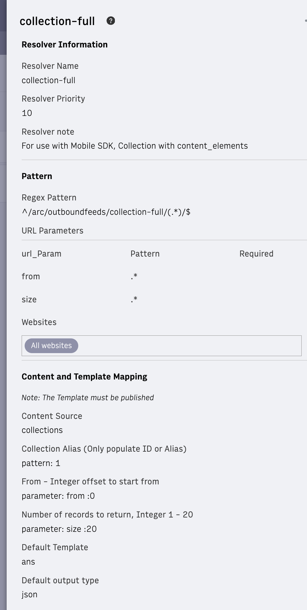
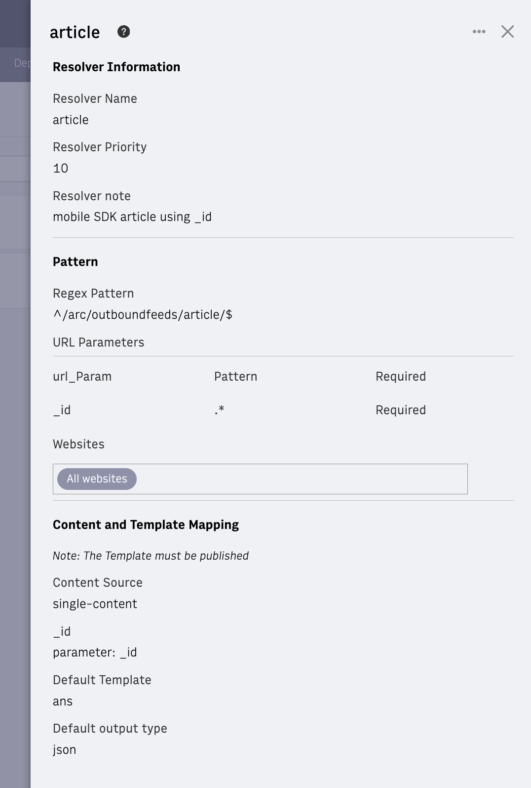
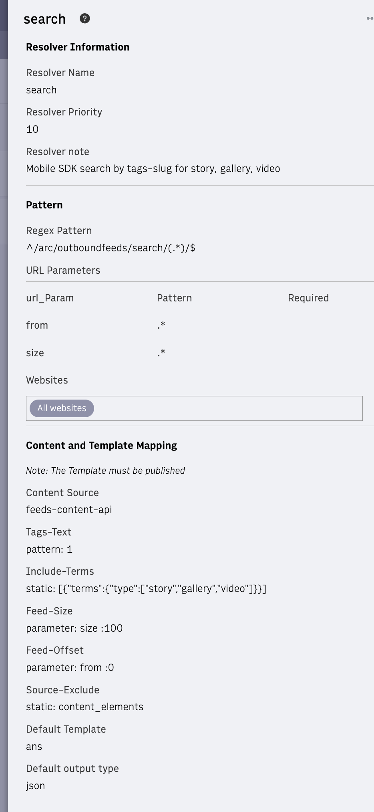
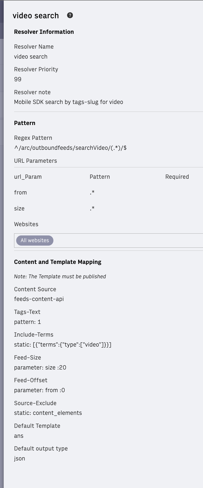

# Resolver Setup

This set up sets up the backend for the Mobile SDK.

Resolvers populate the content to outbound feeds (OBF). Without resolvers, no data is available. Use caution when editing or adding resolvers as small mistakes can cause data to not be available (can affect your other sites).

The resolvers provided in this document are the resolvers that power collections, navigation, article, and site service calls to the mobile SDK. Setting up these resolvers lets content feed into the endpoints that the Mobile SDK uses. To learn more, see [How to set up resolvers for outbound feeds](https://docs.arcxp.com/en/products/arc-i-o/setting-up-resolvers-for-outbound-feeds.html).

## Confirming the resolver functionality is enabled

Use the following steps to confirm the resolver functionality is enabled in your environment. A different resolver set exists for each environment, so ensure you select the appropriate environment before navigating.

1. Navigate your organization's Arc XP home page.
2. Click the **outbound feeds** tile under Experiences. PageBuilder opens.

    
    If you don't have an outbound feeds under Experiences, contact your Technical Account Manager to have the Outbound Feeds product added.
    

3. Click **Developer Tools > Resolvers** from the menu at the top.
4. Click **New Resolver**.
5. Scroll to the Default Template section and expand the drop-down menu. Confirm an `ans` entry exists. If the entry does not exist, contact your Technical Account Manager and request that the OBF bundle be installed that includes and ANS template. If the template is not installed, discontinue this tutorial until the OBF bundle is installed and the template is available.

## Default Resolver Parameters

The following list describes the resolvers that you must set up in order to feed content to the outbound feeds that the Mobile SDK uses.

If any of the content sources described here are not available in your drop-down menu, see [Deploying new outbound feeds features](https://dev.arcxp.com/arc-io/developer-docs/deploying-new-outbound-feeds-features/) to create or update your OBF repository bundle and re-deploy.

Testing Notes:

- OBF only returns published items

- UUIDs are case sensitive

<table style="border-collapse: collapse; width: 100%;" border="1"><tbody><tr><td style="width: 49.5434%;"><h3>Navigation</h3>
Feeds the site service data. Without this resolver, menus do not show.
<ul style="list-style-position: inside;"><li><strong>Regex Pattern</strong>: ^/arc/outboundfeeds/navigation/(.*)/$</li><li><strong>Content Source</strong>: site-service-hierarchy</li><li><strong>Hierarchy</strong>: Type = Pattern, value = 1</li><li><strong>Default Template</strong>: ans</li><li><strong>Default output type</strong>: json</li></ul>
Example URL: <a href="https://arcsales-arcsales-sandbox.web.arc-cdn.net/arc/outboundfeeds/navigation/mobile-nav/">https://arcsales-arcsales-sandbox.web.arc-cdn.net/arc/outboundfeeds/navigation/mobile-nav/</a>
</td><td style=""></td></tr></tbody></table>

<table style="border-collapse: collapse; width: 100%;" border="1"><tbody><tr><td style="width: 49.5434%;"><h3>Collection</h3>
Feeds content data when preloading is not enabled.
<ul style="list-style-position: inside;"><li><strong>Regex Pattern</strong>: <code>^/arc/outboundfeeds/collection/([^/]*)/$</code></li><li><strong>Content Source</strong>: collections</li><li><strong>Collection Alias</strong> (only populate ID or Alias): Type = Pattern, value = 1</li><li><strong><code>from</code> </strong>(integer offset to start from): Type = Parameter, parameter = from, value = 0 For the <code>from</code> and <code>size</code> values, you must create the parameters using the Add Parameter button under URL Parameters. Create new parameters <code>from</code> and <code>size</code> and keep the pattern <code>.*</code>. You can then use these parameters in the Content and Template Mapping section.</li><li><strong>Number of records to return</strong> (an integer 1-20): Type = Parameter, parameter = size, value = 20</li><li><strong>ANS Fields to Exclude </strong>(use commas between fields): Type = static, value = content_elements</li><li><strong>Default Template</strong>: ans</li><li><strong>Default output type</strong>: json</li></ul>
Example URLs:

<a href="https://arcsales-arcsales-sandbox.web.arc-cdn.net/arc/outboundfeeds/collection-full/mobile-video/">https://arcsales-arcsales-sandbox.web.arc-cdn.net/arc/outboundfeeds/collection-full/mobile-video/</a>

<a href="https://arcsales-arcsales-sandbox.web.arc-cdn.net/arc/outboundfeeds/collection-full/mobile-video/?size=1">https://arcsales-arcsales-sandbox.web.arc-cdn.net/arc/outboundfeeds/collection-full/mobile-video/?size=1</a> just first item

<a href="https://arcsales-arcsales-sandbox.web.arc-cdn.net/arc/outboundfeeds/collection-full/mobile-video/?size=1&from=10">https://arcsales-arcsales-sandbox.web.arc-cdn.net/arc/outboundfeeds/collection-full/mobile-video/?size=1&from=10</a> just one item, but start from index 10
</td><td style="width: 49.5434%;"></td></tr></tbody></table>

<table style="border-collapse: collapse; width: 100%;" border="1"><tbody><tr><td style="width: 49.5434%;"><h3>Collection-full</h3>
Feeds content data when preloading is enabled.
<ul style="list-style-position: inside;"><li><strong>Regex Pattern</strong>: <code>^/arc/outboundfeeds/collection-full/([^/]*)/$</code></li><li><strong>Content Source</strong>: collections</li><li><strong>Collection Alias</strong> (only populate ID or Alias): pattern: 1</li><li><strong><code>from</code> </strong>(integer offset to start from): Type = Parameter, parameter = from, value = 0 For the <code>from</code> and <code>size</code> values, you must create the parameters using the Add Parameter button under URL Parameters. Create new parameters <code>from</code> and <code>size</code> and keep the pattern <code>.*</code>. You can then use these parameters in the Content and Template Mapping section.</li><li><strong>Number of records to return</strong> (an integer 1-20): Type = Parameter, parameter = size, value = 20</li><li><strong>Default Template</strong>: ans</li><li><strong>Default output type</strong>: json</li></ul><blockquote><strong>Note</strong>: When the entire article is desired (<code>preLoading</code> is enabled) with each collection call. Subsequent calls for the article ID return the article from cache. </blockquote>
Example URLs:

<a href="https://arcsales-arcsales-sandbox.web.arc-cdn.net/arc/outboundfeeds/collection/mobile-video/">https://arcsales-arcsales-sandbox.web.arc-cdn.net/arc/outboundfeeds/collection/mobile-video</a>

<a href="https://arcsales-arcsales-sandbox.web.arc-cdn.net/arc/outboundfeeds/collection/mobile-video/?size=1">https://arcsales-arcsales-sandbox.web.arc-cdn.net/arc/outboundfeeds/collection/mobile-video/?size=1</a> just first item

<a href="https://arcsales-arcsales-sandbox.web.arc-cdn.net/arc/outboundfeeds/collection/mobile-video/?size=1&from=10">https://arcsales-arcsales-sandbox.web.arc-cdn.net/arc/outboundfeeds/collection/mobile-video/?size=1&from=10</a> just one item, but start from index 10
</td><td style="width: 49.5434%;"></td></tr></tbody></table>

<table style="border-collapse: collapse; width: 100%;" border="1"><tbody><tr><td style="width: 49.0063%;"><h3>Article</h3>
Feeds content data for articles.
<ul style="list-style-position: inside;"><li><strong>Regex Pattern</strong>:<code>^/arc/outboundfeeds/article/$</code></li><li><strong>Content Source</strong>: single-content</li><li><code><strong>_id</strong></code>: parameter = _id For <code>_id</code>, you must create the parameter using the Add Parameter button under URL Parameters. Create a new <code>_id</code> parameter and keep the pattern <code>.*</code>. Select the <strong>required</strong> checkbox.</li><li><strong>Default Template</strong>: ans</li><li><strong>Default output type</strong>: json</li></ul>
&nbsp;

&nbsp;

Example URL:

<a href="https://arcsales-arcsales-sandbox.web.arc-cdn.net/arc/outboundfeeds/article/?_id=Y5BE6ODY4VBCLHNIPOEOQ3BU7U">https://arcsales-arcsales-sandbox.web.arc-cdn.net/arc/outboundfeeds/article/?_id=Y5BE6ODY4VBCLHNIPOEOQ3BU7U</a>
</td><td style="width: 49.0063%;"></td></tr></tbody></table>

<table style="border-collapse: collapse; width: 100%;" border="1"><tbody><tr><td style="width: 49.0063%;"><h3>Search</h3>
Feeds content data for searches.
<ul style="list-style-position: inside;"><li><strong>Regex Pattern</strong>: <code>^/arc/outboundfeeds/search/(.*)/$</code></li><li><strong>Content Source</strong>: feeds-content-api</li><li><strong><code>from</code> </strong>(integer offset to start from): Type = Parameter, parameter = from, value = 0 For the <code>from</code> and <code>size</code> values, you must create the parameters using the Add Parameter button under URL Parameters. Create new parameters <code>from</code> and <code>size</code> and keep the pattern <code>.*</code>. You can then use these parameters in the Content and Template Mapping section.</li><li><strong>Number of records to return</strong> (integer 1-20): Type = Parameter, parameter = size, value = 20</li><li><strong>Tags-Text</strong>: Type = Pattern, value = 1</li><li><strong>Tags-Slug</strong>: Type = Pattern, value = 1</li><li><strong>Include-Terms</strong>: Type = static, value = [{"terms":{"type": ["story","gallery","video"]}}]</li><li><strong>Source-Exclude</strong>: Type = static, value = content_elements</li><li><strong>Default Template</strong>: ans</li><li><strong>Default output type</strong>: json</li></ul><blockquote><strong>Note</strong>: Set up this resolver the way you want your search to work. You could search for keywords or tags or create a custom content source to work the way you want.</blockquote><blockquote>This example is for tags but for keywords instead omit the 2 'tags' above and use the same values for 'keywords'</blockquote>
Example URLs:

<a href="https://arcsales-arcsales-sandbox.web.arc-cdn.net/arc/outboundfeeds/search/a/">https://arcsales-arcsales-sandbox.web.arc-cdn.net/arc/outboundfeeds/search/a/</a>

<a href="https://arcsales-arcsales-sandbox.web.arc-cdn.net/arc/outboundfeeds/search/sample/?size=2">https://arcsales-arcsales-sandbox.web.arc-cdn.net/arc/outboundfeeds/search/sample/?size=2</a>
</td><td style="width: 49.0063%;"></td></tr></tbody></table>

<table style="border-collapse: collapse; width: 100%;" border="1"><tbody><tr><td style="width: 49.0063%;"><h3>Search Video</h3>
Feeds content data for video-only searches (same as the Search resolver, just filters results for video only)
<ul style="list-style-position: inside;"><li><strong>Regex Pattern</strong>: ^/arc/outboundfeeds/searchVideo/(.*)/$</li><li><strong>Content Source</strong>: feeds-content-api</li><li><strong><code>from</code> </strong>(integer offset to start from): Type = Parameter, parameter = from, value = 0 For the <code>from</code> and <code>size</code> values, you must create the parameters using the Add Parameter button under URL Parameters. Create new parameters <code>from</code> and <code>size</code> and keep the pattern <code>.*</code>. You can then use these parameters in the Content and Template Mapping section.</li><li><strong>Number of records to return</strong> (integer 1-20): Type = Parameter, parameter = size, value = 20</li><li><strong>Tags-Text</strong>: Type = Pattern, value = 1</li><li><strong>Tags-Slug</strong>: Type = Pattern, value = 1</li><li><strong>Include-Terms</strong>: Type = static, value = [{"terms":{"type": ["video"]}}]</li><li><strong>Source-Exclude</strong>: Type = static, value = content_elements</li><li><strong>Default Template</strong>: ans</li><li><strong>Default output type</strong>: json</li></ul><blockquote><strong>Note</strong>: Set up this resolver the way you want your search to work. You could search for keywords or tags or create a custom content source to work the way you want.</blockquote><blockquote>This example is for tags but for keywords instead omit the 2 'tags' above and use the same values for 'keywords'</blockquote>
Example URL:

<a href="https://arcsales-arcsales-sandbox.web.arc-cdn.net/arc/outboundfeeds/searchVideo/sample/">https://arcsales-arcsales-sandbox.web.arc-cdn.net/arc/outboundfeeds/searchVideo/sample/</a>
</td><td style="width: 49.0063%;"></td></tr></tbody></table>

## Additional Resources

* [How to Set Up Resolves for Outbound Feeds](https://docs.arcxp.com/en/products/arc-i-o/setting-up-resolvers-for-outbound-feeds.html)
* [Deploying New Outbound Feeds Features](https://dev.arcxp.com/arc-io/developer-docs/deploying-new-outbound-feeds-features/)
* [How to Set Up and Configure an Outbound Feed](https://docs.arcxp.com/en/products/arc-i-o/how-to-set-up-and-configure-an-outbound-feed.html)
* [Content Sources with Outbound Feeds](https://dev.arcxp.com/arc-io/developer-docs/content-source-blocks-in-outbound-feeds/)
* [Outbound Feeds Environment](https://dev.arcxp.com/arc-io/developer-docs/outbound-feeds-environments/)
