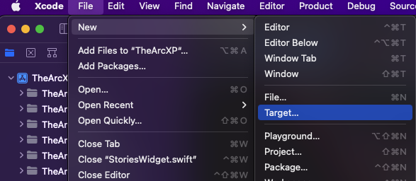
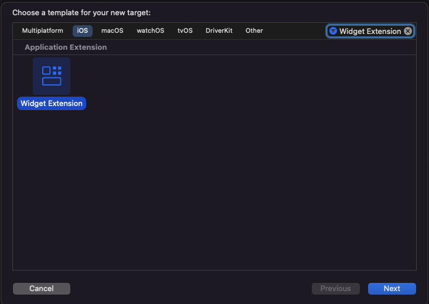
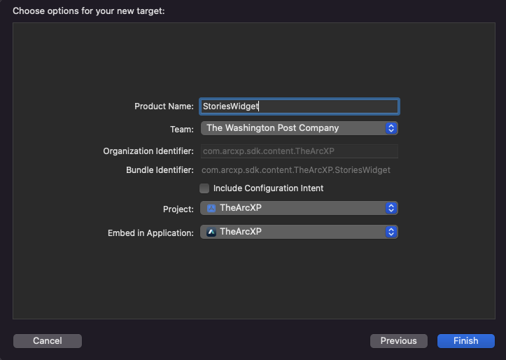
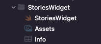
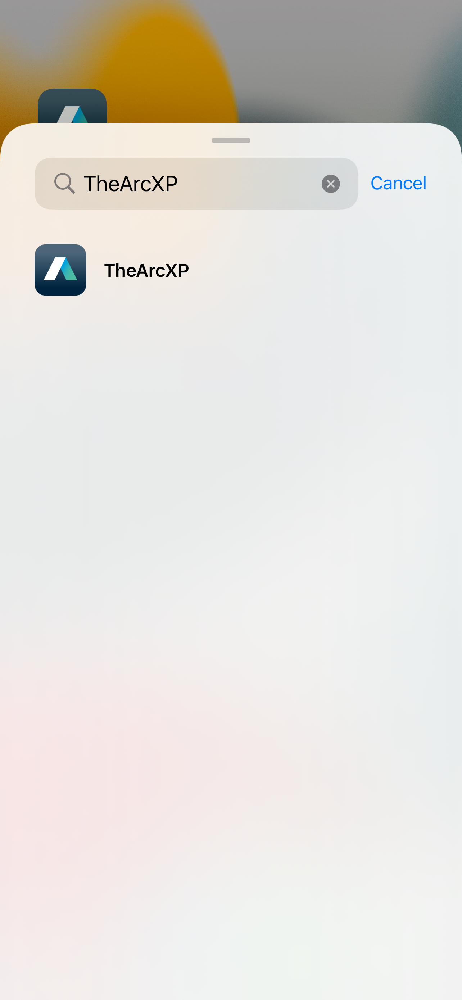
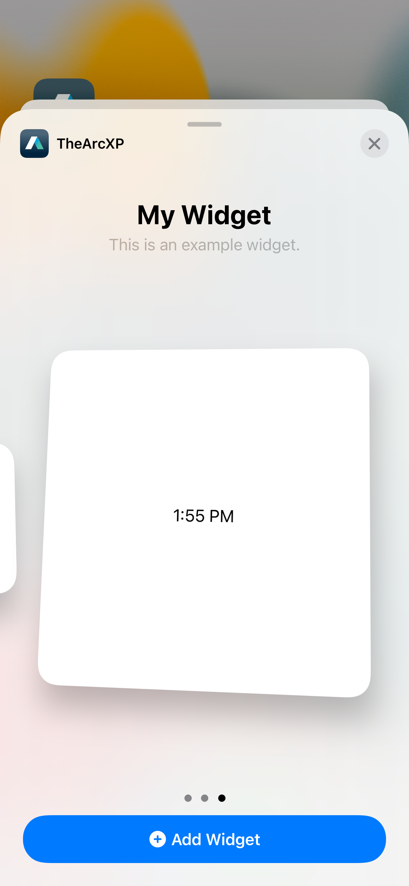
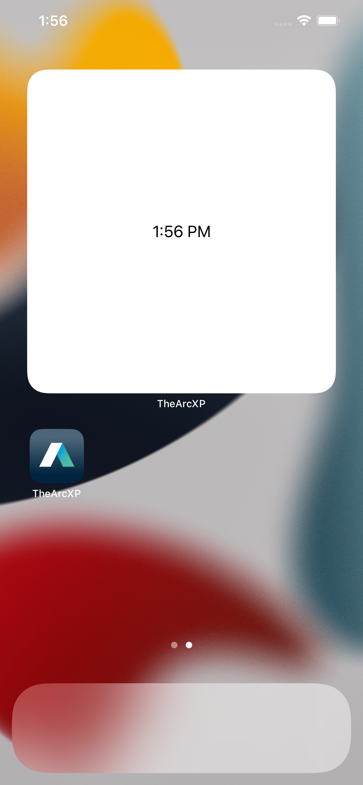
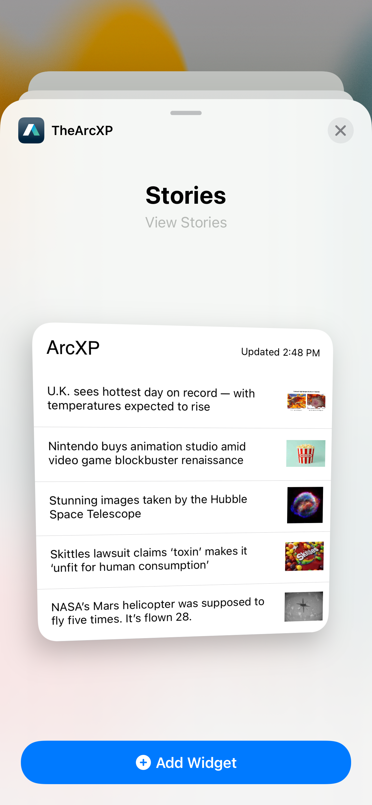
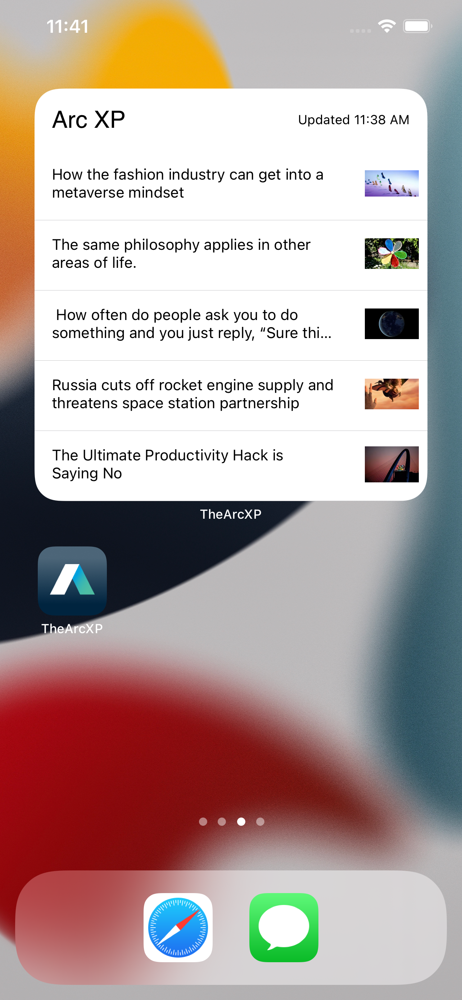

# iOS NewsApp Widget Documentation

## Workflow for creating a Widget for your Application

1. Add a widget extension to your existing application
2. Configure a custom data model for your widget to display
3. Create preview data to display while the widget is in transient states.
4. Modify a timeline and get data for the widget
5. Create navigation from Widget to Application

### Goal

To configure your app with a Widget that displays Stories and navigates to a detail view on interaction with the Widget.


## Adding the Widget Extension

Within the Xcode project start by adding a widget extension with **File -> New -> Target**



Within the iOS platform search for "Widget Extension" and click **next**



Select the options for your new widget. Make sure **Include Configuration Intent** is unchecked before proceeding. Click **Finish**.



Once the Widget is added, in the project navigator you will see its folder with one swift file named **StoriesWidget**.



Note after creating a Widget Extension your Xcode settings may default **StoriesWidgetExtension** to the current scheme.


If the **StoriesWidgetExtension** is selected as the current scheme select the app as the current scheme. With the app selected as the current scheme run the app. Tap the home button and hold down a click until app icons start to move. Depending on what device, a **+** will appear in either the left or right corner. Tap it and the widget gallery will appear. Search for your app’s display name.



Select the app. Next swipe and select the widget size you prefer and click the **Add Widget** button. WidgetKit offers different sizes depending on the users OS version.



With the boilerplate code provided by Xcode this is how your widget will look.



## Configure Widget for Stories functionality

Within the `StoriesWidget` file there are three required functions to take note of.

* `placeholder(in:)` is called when the widget is displayed for the first time. This will render the widget’s view as a placeholder and gives the user an idea of what the widget will display. This instance method is synchronous

* `getSnapshot(in:completion:)` is called when the widget appears in transient situations such as when the user is adding a widget to their home screen. This instance method should be supplied with preview data to show your user a quick glimpse of how your widget will look.

* `getTimeline(in:completion:)` supplies an array of entries based on time stamps for the widget to display. You can also add a refresh policy to this method, this will update the widget based on how often you need it refreshed. You can call asynchronous or synchronous methods here.

Create a new swift file named `HeadlineData` . Check the files Target Membership to be `StoriesWidgetExtension`.

`HeadlineData` will serve as a data model that represents each story section within the widget.

```swift
import UIKit

struct HeadlineData: Identifiable {
    let identifier: String // Each story headline will have a unique ID
    let headline: String // Headline text
    var headlineImageURL: String? // Each headline might have an image, that is why its an optional.
    var placeHolderImageFilename: String? // Only for use in transient states
    var id: String { identifier }
}
```

The identifier property will serve as each rows unique identifier. Next, go back to `StoriesWidget` file. Refactor and rename the `SimpleEntry` struct to `StoriesEntry`. After doing so build the project to ensure there are no errors. Edit the `StoriesEntry` struct to contain a variable named stories that will contain an array of `HeadlineData`

```swift
struct StoriesEntry: TimelineEntry {
    let date: Date
    var stories: [HeadlineData]
}
```

Build the project, it will contain a few errors because `StoriesEntry` is missing an argument for the new variable we created. Next, within the `Provider` struct delete the boilerplate code out of the body for each of the three required functions; `placeholder(in:)`, `getSnapshot(in:completion:)`, and `getTimeline(in:completion:)`.

```swift
struct Provider: TimelineProvider {
    func placeholder(in context: Context) -> TopStoriesEntry {
      
    }

    func getSnapshot(in context: Context, completion: @escaping (TopStoriesEntry) -> Void) {
     
    }

    func getTimeline(in context: Context, completion: @escaping (Timeline<Entry>) -> Void) {
   
    }
}
```

Now, let create a struct that contains static properties for our preview data. Create a Swift file named `MockDataConstants`. Inside the file create a struct named `MockDataConstants`. This struct will contain two more structs, `Headlines` and `Images` containing static properties.

```swift
import Foundation

struct MockDataConstants{
    struct Headlines {
        static let storyOneHeadline = "U.K. sees hottest day on record — with temperatures expected to rise"
        static let storyTwoHeadline = "Nintendo buys animation studio amid video game blockbuster renaissance"
        static let storyThreeHeadline = "Stunning images taken by the Hubble Space Telescope"
        static let storyFourHeadline = "Skittles lawsuit claims ‘toxin’ makes it ‘unfit for human consumption’"
        static let storyFiveHeadline = "NASA’s Mars helicopter was supposed to fly five times. It’s flown 28."
    }
    struct Images {
        static let storyOneImage = "UKHotTemps"
        static let storyTwoImage = "Nintendo"
        static let storyThreeImage = "Hubble"
        static let storyFourImage = "skittles"
        static let storyFiveImage = "Mars"
    }
}
```

Replace the static properties with data you see fit. Next, lets supply `placeholder(in:)` and `getSnapshot(in:completion:)` with our mock data. At the top of `Provider` declare a constant named `previewData`. This constant will be an array of `HeadlineData`. Supply the two synchronous instance methods with `previewData`.

```swift
struct Provider: TimelineProvider {
    // Data for widget while in a transient state.
    let previewData = [HeadlineData(identifier: NSUUID().uuidString,
                                        headline: MockDataConstants.Headlines.storyOneHeadline,
                                        placeHolderImageFilename: MockDataConstants.Images.storyOneImage),
                           HeadlineData(identifier: NSUUID().uuidString,
                                        headline: MockDataConstants.Headlines.storyTwoHeadline,
                                        placeHolderImageFilename: MockDataConstants.Images.storyTwoImage),
                           HeadlineData(identifier: NSUUID().uuidString,
                                        headline: MockDataConstants.Headlines.storyThreeHeadline,
                                        placeHolderImageFilename: MockDataConstants.Images.storyThreeImage),
                           HeadlineData(identifier: NSUUID().uuidString,
                                        headline: MockDataConstants.Headlines.storyFourHeadline,
                                        placeHolderImageFilename: MockDataConstants.Images.storyFourImage),
                           HeadlineData(identifier: NSUUID().uuidString,
                                        headline: MockDataConstants.Headlines.storyFiveHeadline,
                                        placeHolderImageFilename: MockDataConstants.Images.storyFiveImage)]
    // MARK: - placeholder(in:)
    func placeholder(in context: Context) -> StoriesEntry {
        // Is called when the widget is displayed for the first time. This instance method is synchronous.
        return StoriesEntry(date: Date(), stories: previewData)
    }
    // MARK: - getSnapshot(in:completion:)
    func getSnapshot(in context: Context, completion: @escaping (StoriesEntry) -> Void) {
        // Is is called when the widget appears in transient situations such as when the user is adding a widget to their home screen.
        let entry = StoriesEntry(date: Date(),
                                 stories: previewData)
        completion(entry)
    }
}
```

## Getting a Glimpse of the Widget

Now lets see how our widget looks in its transient states. First we need to create our views. Create four new SwiftUI files and name them the following.

* `WidgetView`
* `WidgetTopBarView`
* `WidgetRowView`
* `RowImageView`

```swift
import SwiftUI

struct WidgetView: View {
    var updatedTime: Date
    var stories: [HeadlineData]
    
    init(updatedTime: Date, stories: [HeadlineData]) {
        self.updatedTime = updatedTime
        self.stories = stories
    }
    
    var body: some View {
        VStack {
            WidgetTopBarView(updatedTime: updatedTime)
            ForEach(stories) { story in
                if let id = URL(string: story.identifier) {
                    Link(destination: id) {
                        WidgetRowView(headline: story.headline,
                                      headlineImageURL: story.headlineImageURL,
                                      placeholderFilename: story.placeHolderImageFilename)
                    }
                }
            }
        }
    }
}
```

```swift
import SwiftUI

struct WidgetTopBarView: View {
    var updatedTime: Date?
    
    init(updatedTime: Date? = nil) {
        self.updatedTime = updatedTime
    }
    
    var body: some View {
        GeometryReader { geometry in
            HStack {
                Text(Constants.WidgetConstants.organizationName)
                    .font(.custom(Constants.Fonts.ArcXPFontName, size: 20))
                    .frame(maxWidth: geometry.size.width / 2, alignment: .leading)
                    .padding()
                if let date = updatedTime {
                    Text("\(Constants.WidgetConstants.updated) \(DateFormatter.widgetFormatter.string(from: date))")
                        .font(.system(size: 12))
                        .frame(maxWidth: geometry.size.width / 2, alignment: .trailing)
                        .padding()
                }
            }
        }
    }
}
```

```swift
import SwiftUI

struct WidgetRowView: View {
    var headline: String
    var headlineImageURL: String?
    var placeholderFilename: String?
    
    init(headline: String, headlineImageURL: String? = nil, placeholderFilename: String? = nil) {
        self.headline = headline
        self.headlineImageURL = headlineImageURL
        self.placeholderFilename = placeholderFilename
    }
    
    var body: some View {
        GeometryReader { geometry in
            VStack {
                HStack {
                    Text(headline)
                        .font(.system(size: 14))
                        .frame(maxWidth: geometry.size.width, alignment: .leading)
                        .padding([.leading, .trailing])
                    RowImageView(withURL: headlineImageURL ?? "", withFilename: placeholderFilename)
                        .frame(maxWidth: 50, maxHeight: 50)
                    Spacer()
                }
                Divider()
            }
        }
    }
}
```

Now that we have our views, go to `StoriesWidget` and update `StoriesWidgetEntryView` to have WidgetView in its body initialized with data.

```swift
struct StoriesWidgetEntryView: View {
    var entry: Provider.Entry
    var body: some View {
        WidgetView(updatedTime: entry.date, stories: entry.stories)
    }
}
```

Run the app and exit the app, go to the widget gallery and search for the app name and select the app. Now you can see our preview data while the widget is in a transient state. This is the first impression your user will have of your widget.



## Getting Story Data

Since we need to leverage ArcXPContentSDK to get Stories. Go to the project’s podfile and add the following to it.

```ruby
target 'StoriesWidgetExtension' do
  pod 'ArcXP', '0.0.5'
end
```

Save the Podfile and in the terminal cd to the project directory and run pod install. Next we need a function to handle our api call to get our Stories. If you already have a ViewModel class that handles getting story data skip ahead to the code snippet below, else create a new swift file named `ContentViewModel`. In the new file Import `ArcXPContentSDK` and define the class `ContentViewModel`. Create a function called `fetchTopStoriesCollectionForWidget`. This function will accept the following parameters, `alias: String, index: Int, size: Int`. We also need a function to get the story’s headline image.

```swift
import ArcXP

class ContentViewModel {
    func fetchTopStoriesCollectionForWidget(alias: String, index: Int, size: Int, completion: @escaping ArcXPCollectionResultHandler) {
        ArcXPContentManager.client.getCollection(alias: alias, index: 0, size: size) { result in
            switch result {
            case .success(let stories):
                completion(.success(stories))
            case .failure(let error):
                completion(.failure(error))
            }
        }
    }

func getResizedImageURLForWidget(for arcXPContent: ArcXPContent) -> String? {
        if let imageElement = arcXPContent.promoItems?.content as? ImageContentElement,
           let imageResizeURLString = imageElement.additionalProperties?.thumbnailResizeUrl {
            return "https://\(Constants.contentDomain)\(imageResizeURLString)"
        }
        return nil
    }
}
```

Next, go back to the `StoriesWidget` file. In our `getTimeline(in:completion:)` instance method is where we will make our API call. First we need to initialize our SDK before we make calls through the Content SDK Module. After that we create an empty array of `TopStoriesEntry` named entries and a `TopStoriesEntry` named entry that appends `HeadlineData` to itself on success we append `entry` to `entries` and configure a refresh policy.

```swift
// MARK: - getTimeline(in:completion:)
    func getTimeline(in context: Context, completion: @escaping (Timeline<Entry>) -> Void) {
        // Supplies an array of entries based on time stamps for the widget to display. Asychronous or synchronous methods here.
        // SDK must be initialized before fetching content
        SDKHelper.initializeSDK()
        var entries: [StoriesEntry] = []
        var entry = StoriesEntry(date: Date(),
                                 stories: [HeadlineData]())
        let viewModel = ContentViewModel()
        viewModel.fetchStoriesCollectionForWidget(alias: Constants.WidgetConstants.alias, index: 0, size: 5) { result in
            switch result {
            case .success(let stories):
                var imageURL: String?
                for story in stories {
                    if let imageURLString = viewModel.getResizedImageURLForWidget(for: story) {
                        imageURL = imageURLString
                    }
                    entry.stories.append(HeadlineData(identifier: story.identifier ?? "",
                                                      headline: story.headlines?.basic ?? "",
                                                      headlineImageURL: imageURL))
                }
                entries.append(entry)
                let timeline = Timeline(entries: entries, policy: .atEnd)
                completion(timeline)
            case .failure:
                break
            }
        }
    }
```

Run the app and view it’s widget on the home screen.



## Navigating from Widget Story to App

Since we added a `Link` control within the `ForEach` of `WidgetView`, each `WidgetRowView` contains an Identifier wrapped as an URL. When a story is tapped the individual row’s identifier to the app by using: 

```swift
onOpenURL(perform action: **@escaping** (URL) -> ()) -> **some** View
``` 

`onOpenUrl` delivers a URL to a scene or window the view is in.

```swift

.onOpenURL { id in
// Present a detail view and initialize it with id.
}
```
