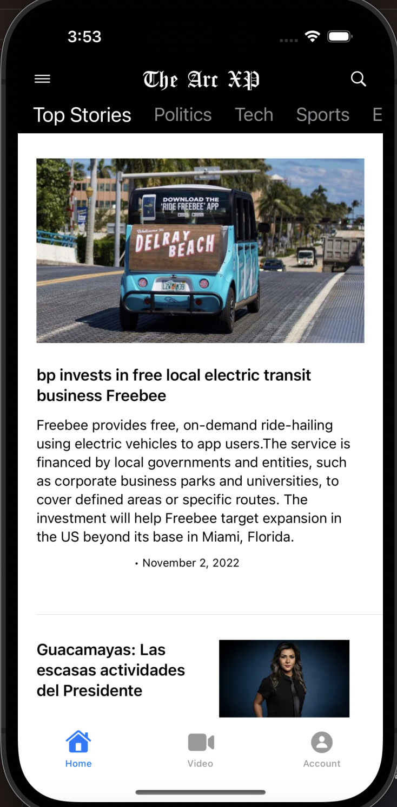

# The Arc XP (News App) iOS Sample Project

The Arc XP iOS sample app is a simple news app created using our unified mobile SDK to demonstrate various Arc XP SDK services such as fetching articles, login/logout, and playing videos. Clients can fork our sample repository on GitHub and customize it to their liking, or reference it as an example for our SDK in their applications.



## Getting Access


the repository can be found here: [https://github.com/arcxp/the-arcxp-ios](https://github.com/arcxp/the-arcxp-ios)

## SDK Setup

More in depth instructions for the SDK can be found in [Getting Started with Arc XP iOS SDK](getting-started-initialization.md).

The configuration parameters needed for SDK initialization in the sample app are found in the `Constants` file in the Org struct, this file is found in the `Utilities` folder. You will need to alter these based on your **org**, **site**, **baseURL**, **site service**, and **video collection** names:

```
    struct Org {

        static let siteName = "arcsales"

        static let orgName = "arcsales"

        static let env = "sandbox"

        static let contentDomain = "arcsales-arcsales-sandbox.web.arc-cdn.net"

        static let commerceDomain = "arcsales-arcsales-sandbox.api.cdn.arcpublishing.com"


        static let siteHierarchyName = "mobile-nav"

        static let videoCollectionAlias = "mobile-video"

    }
```

## Customization

### Content

See the **configuration** section in the [ArcXP iOS SDK Module Setup guide](getting-started-initialization.md#Configuration%20Details) to establish your site categories with Site Service. The name you give this will correspond to the siteHierarchyName in your `Constants` file under the `Org` struct.

Keep following the guide linked above to create Collections using WebSked to match your Site Service categories. Furthermore, you can define your own videoCollectionAlias in your `Constants` file for a video only list corresponding with a WebSked collection id.

### App Icons

Follow Apple's [best practices for creating app icons](https://developer.apple.com/design/human-interface-guidelines/app-icons).

The app icons should be placed in an `.xcassets` catalog, the application includes one named `Assets.xcassets`.

### Fonts

Apple has default fonts, but you can add any `.ttf` file to your Xcode project. You can do this by either dragging and dropping the file into your Xcode project, or by selecting **File > Add Files to “Your Project Name”** from the menu bar in Xcode. Make sure the font file is a target member of your app.

Next you need to register your font file with iOS by including it in the `info.plist` file. See [Adding a Custom Font to Your App](https://developer.apple.com/documentation/uikit/text_display_and_fonts/adding_a_custom_font_to_your_app) for a detailed guide on how to do this.

### Colors

All the app colors are in the `ThemeManager` file in the `Utilities` folder.

You can change any of the colors to your liking if desired.

More colors are available to override including error color, background, text color, edit text color, etc.

## Google Ad Integration

Follow the instructions in the article [The Arc XP News App - Google AdMob Implementation](the-arc-xp-news-app-google-admob-implementation.md).

## Firebase/Google Analytics Integration

Follow the instructions in the article [Firebase Setup for News App - Analytics/Push notifications](firebase-setup-for-news-app-analyticspush-notifications.md)

## App Store Submission

Once you have fully customized the app with your credentials and confirmed you getting data back as expected, you may choose to submit to the App Store for further testing and finally release to the public.

To distribute to the App Store:

You need to customize the Bundle Identifier for your app, it must be unique(Xcode will remind you if the bundle ID you've chosen has been taken).

See [Creating an Xcode Project for an APP](https://developer.apple.com/documentation/xcode/creating-an-xcode-project-for-an-app) for more information about the app setup.

You will need custom icons, app screen shots, signing certs, and other elements required by the App Store submission.